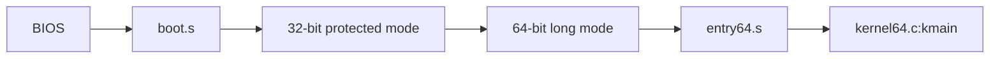
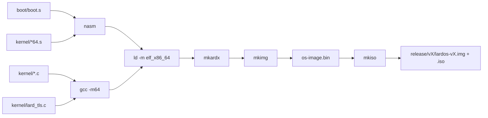
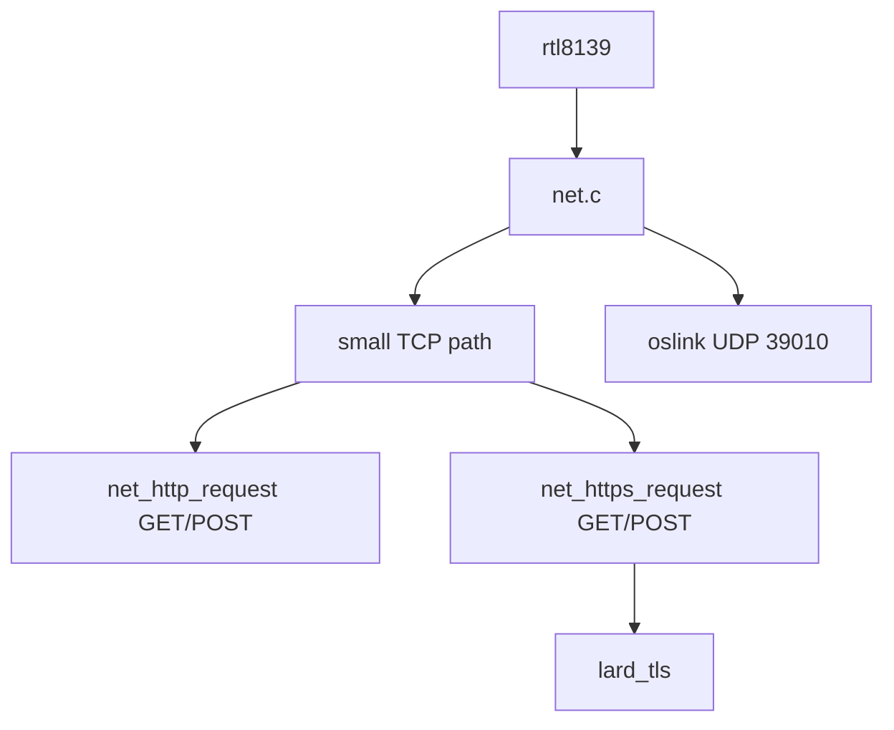

# LardOS Architecture

## Shape

```text
lardos/
|-- os/
|   |-- boot/        BIOS boot sector and long-mode transition
|   |-- kernel/      64-bit kernel C and assembly
|   |-- include/     kernel headers
|   |-- scripts/     host build tools
|   |-- lang/        BOSL, GASM, LIL, LML, examples, libraries
|   |-- tools/       host LIL
|   |-- Makefile
|   |-- deps.mk
|   `-- linker.ld
`-- build/
```

There is no `third_party/` TLS tree. TLS work lives in `kernel/lard_tls.c` and
`include/lard_tls.h`.

## Boot



The boot sector uses the 32-bit phase only as a bridge into long mode. The
kernel payload is built with `-m64`, linked as `elf_x86_64`, and entered through
`entry64.s`.
Stage2 keeps bootinfo at `0x9C000` and its temporary protected-mode stack at
`0x9F000`, above the kernel staging buffer. The long-mode entry stack starts at
`0x7F0000`, away from VGA, EBDA, bootinfo, and staging data, so the native boot
path has room as the in-tree kernel grows.

At runtime the kernel also owns a controlled CPU mode bridge. `cpumode.c` copies
a low-memory trampoline to `0x6000`, and `mode_switch.s` can briefly walk from
64-bit long mode through a 32-bit protected-mode selector into real mode, then
restore paging, EFER, CR3, and the 64-bit code segment before returning to C.
PanicRoom uses the same bridge to draw its default real16 VGA texture before
returning to long64 recovery controls. The bridge is explicit: use `mode probe`,
`panicroom texture`, the boot-time `M` option, or POST.

## Kernel

```mermaid
flowchart TB
    Kmain["kernel64.c"]
    GDT["gdt64"]
    IDT["idt64 / isr64"]
    MMU["mmu"]
    CpuMode["cpumode + mode_switch"]
    SMP["smp + ap_trampoline"]
    Syscall["syscall"]
    Drivers["pci / rtl8139 / ps2 / rtc"]
    Storage["fs / lfs / ldll / lpack"]
    POST["post diagnostics"]
    Net["net DHCP DNS TCP HTTP"]
    OSLink["oslink OS-to-OS UDP"]
    TaskPrio["taskprio user priorities"]
    BootProf["bootprof profiles"]
    Awake["awake fast boot tracker"]
    CrashLog["crashlog panic history"]
    LardKit["lardkit user-control suite"]
    BugReplay["bugreplay + trace + journal + recovery tools"]
    LPack["lpack packages"]
    ScreenCheck["screencheck diagnostics"]
    TLS["lard_tls native TLS"]
    GUI["gui / screenram / lafillo / lsh"]
    EXGUI["exgui DE + WM layer"]
    EXEXGUI["exexgui split DE shell"]
    LGUILIB["lguilib GUI library format"]
    VM["BOSL GASM LIL LML OSVM"]

    Kmain --> GDT
    Kmain --> IDT
    Kmain --> MMU
    Kmain --> CpuMode
    Kmain --> SMP
    Kmain --> Syscall
    Kmain --> Drivers
    Kmain --> Storage
    Storage --> BootProf
    Storage --> CrashLog
    Storage --> LardKit
    LardKit --> BugReplay
    Storage --> LPack
    Kmain --> POST
    Kmain --> Net
    Net --> OSLink
    Net --> TLS
    Kmain --> GUI
    GUI --> EXGUI
    GUI --> EXEXGUI
    GUI --> LGUILIB
    GUI --> ScreenCheck
    GUI --> TaskPrio
    BootProf --> Awake
    GUI --> VM
```



## Build



## Networking And TLS



The HTTPS path does not call an external TLS library or host HTTPS bridge.
`lard_tls` owns the TLS 1.2 handshake and record layer for a constrained native
client profile: SNI ClientHello, ServerHello parsing, DER leaf certificate
chain parsing, RSA public-key extraction, SAN/CN and RTC validity checks,
SHA-1/SHA-256/SHA-384 RSA certificate-signature validation, native RSA
trust-anchor matching, RSA ClientKeyExchange, SHA-256 transcript/PRF key
schedule, Finished verification, and AES-128-CBC plus HMAC encrypted
application records.

The implemented cipher suites are `TLS_RSA_WITH_AES_128_CBC_SHA` and
`TLS_RSA_WITH_AES_128_CBC_SHA256`. This is real encrypted HTTPS traffic for
servers that still allow RSA key exchange. It deliberately reports
unsupported-cipher for ECDHE-only sites. Trust anchors live in
`kernel/lard_tls_roots.inc` as subject DER plus RSA public-key parameters
generated from Windows Root stores; the verifier walks the presented chain and
requires the final signature to validate against that native table.

HTTP request construction is shared by HTTP and HTTPS. `net_http_request` and
`net_https_request` support GET and POST, while `net_http_get` and
`net_https_get` remain wrappers for older callers. POST sends
`Content-Length` and `application/x-www-form-urlencoded`; redirects preserve
POST only for 307/308.

`oslink.c` is the small OS-to-OS communication layer. It uses public
`net_udp_send` and `net_udp_recv` helpers, frames packets with an `OSLK`
signature, remembers peers by IPv4/node name, queues inbound hello/ping/text
messages, and sends automatic acknowledgements or pongs. It also owns a local
in-kernel bus where modules can publish channel-labeled messages into the same
inbox shape without touching the network. EXEC packets carry
remote command requests; receivers filter them to safe read/diagnostic commands
and queue accepted work through TaskPrio under the `remote` task name.

## Important Files

| Area | Files |
| --- | --- |
| Boot | `os/boot/boot.s` |
| 64-bit entry | `os/kernel/entry64.s`, `os/kernel/kernel64.c` |
| Descriptor tables | `os/kernel/gdt64.c`, `os/kernel/idt64.c`, `os/kernel/isr64.s` |
| CPU mode bridge | `os/kernel/cpumode.c`, `os/kernel/mode_switch.s`, `os/include/cpumode.h` |
| Memory | `os/kernel/mem.c`, `os/kernel/mmu.c` |
| SMP | `os/kernel/smp.c`, `os/kernel/ap_trampoline.s`, `os/kernel/aux_kernel.s` |
| Power-On Self-Test | `os/kernel/post.c`, `os/include/post.h` |
| Boot profiles | `os/kernel/bootprof.c`, `os/include/bootprof.h` |
| Awakening boot mode | `os/kernel/awake.c`, `os/include/awake.h` |
| Crash log | `os/kernel/crashlog.c`, `os/include/crashlog.h` |
| User-control suite | `os/kernel/lardkit.c`, `os/include/lardkit.h` |
| LardPack packages | `os/kernel/lpack.c`, `os/include/lpack.h` |
| Screen diagnostics | `os/kernel/screencheck.c`, `os/include/screencheck.h` |
| Extended GUI shell | `os/kernel/exgui.c`, `os/include/exgui.h` |
| Sketch split GUI shell | `os/kernel/exexgui.c`, `os/include/exexgui.h` |
| LardOS GUI library format | `os/kernel/lguilib.c`, `os/include/lguilib.h` |
| GUI overlay chrome | `os/kernel/guioverlay.c`, `os/include/guioverlay.h` |
| Network | `os/kernel/net.c`, `os/kernel/rtl8139.c` |
| OS-to-OS link | `os/kernel/oslink.c`, `os/include/oslink.h` |
| Task priority queue | `os/kernel/taskprio.c`, `os/include/taskprio.h` |
| Native TLS | `os/kernel/lard_tls.c`, `os/include/lard_tls.h` |
| GUI and shell | `os/kernel/gui.c`, `os/kernel/lsh.c`, `os/kernel/lafillo.c` |

## Built-In User Tools

`kernel/fs.c` embeds `lardos.lars` as a local control-room document for the Doc
tab and `lardd_guide.lardd` as the native document-format guide. LardOS uses
`LARS` instead of HTML for local structured pages and `LARDD` instead of
Markdown for project documents. `kernel/lard_doc.c` renders both formats with a
small freestanding C parser.

LardKit also owns the local recovery/audit reports. `bugreplay.lardd` stores
recent BugEye frame summaries and `bugreplay draw` renders a small replay
panel. `trace.lardd`, `netwatch.lardd`, and `journal.lardd` capture ordered
module, network, and OS journal events. `postbaseline.lardd` stores the last
POST check set so the next POST can report changes/regressions. `bootreplay.lardd`
records a detailed boot timeline, `paniccapsule.lardd` bundles recovery state,
and `lfsdoctor.lardd` records filesystem plus LPST health. Trust history is kept
in memory as a user-readable permission audit log. LPack verification runs
before install, reports package hash and structural warnings, and captures a
bounded undo snapshot for the last package install.

`gui.c` also owns ScreenRAM, an optional scratch-memory layer backed by a
reserved framebuffer/backbuffer rectangle. The default is a quiet bottom-right
corner; `sram rect x y w h` lets the user sacrifice a chosen screen area. GUI
redraws restore the encoded bytes before blitting so the region behaves like
small RAM while still visibly living in screen memory.

`guioverlay.c` draws a visual chrome layer above the classic GUI after the base
controls render. It can repaint compact safe tabs, active-app labels, button
feedback, shadows, and output frames without changing the underlying GUI hit
testing or app state.

`lguilib.c` owns the `.lguilib` GUI library/theme format. Files begin with
`LGUILIB 1` and use `NAME`, `COLOR`, `WIDGET`, and `END` records. The active
theme is consumed by `guioverlay.c`, so the drawn chrome can change while the
classic GUI, EXGUI, and EXEXGUI behavior stays in place. `default.lguilib` is
embedded in the filesystem and LSH exposes `lguilib show`, `lguilib use`, and
`lguilib test`.

`screencheck.c` wraps the GUI POST framebuffer/layout probe in a user-facing
diagnostic module. `screencheck status` reports changed samples, tile counts,
window bounds, and response-view health; `screencheck retro` draws a full-screen
old boot/storage-style scan so visual glitches can be caught by looking at tile
tracks, edges, and dot-lane visibility.

`exgui.c` is an optional desktop-environment and window-manager layer drawn by
the existing GUI renderer. It keeps the original single-window GUI available and
adds familiar shell chrome for users arriving from Windows, Linux, or macOS:
taskbars, top panels, docks, launchers, focus indicators, and float/tile/stack
window layouts. LSH controls it with `exgui on`, `exgui style`, `exgui layout`,
and `exgui next`.

`exexgui.c` is a second opt-in shell based on the user's sketch. It turns the
screen into three persistent regions: the left region keeps the existing GUI as
the DE/WM center, the top-right region mirrors the LSH terminal, and the
bottom-right region shows status information. The split renderer is separate
from EXGUI, so users can keep the old GUI behavior or enable `exexgui on` when
they want the sketched layout.

`taskprio.c` owns the user-changeable task priority queue used by LSH
background commands. Commands submitted with `&` become numbered tasks with a
default priority; `task set`, `task default`, `task run`, `task boost`, `task
drop`, `task pause`, `task resume`, `task up`, `task down`, `prio`, and `nice`
let the user change scheduling directly. `tasktop` renders the queue with
priority bars, runnable/paused counts, and command names. The queue selects the
highest effective priority and ages waiting tasks. User-visible priorities are
`0..10`; `lev.10` is an urgent level the user can grant directly with
`task urgent id`, `task set id 10`, `prio id 10`, `nice 10 command`,
`task default 10`, or `task boost`. It is not produced by aging and is selected
before normal scoring whenever it is queued. `task history`, `prio history`,
and `priority history` keep an in-kernel audit trail of lev.10 grants with
actor, sequence, action, and task name.

`bootprof.c` reads `bootprof.txt` after the writable filesystem is restored and
turns it into boot behavior. `normal` uses the default path, `safe` forces POST
and disables networking, `netoff` skips networking without forcing POST, and
`dev` keeps networking while raising the default task priority. `awakening`
shows the GUI/shell surface as soon as the essential core is up and lets
drivers, language demos, and networking finish in the background. Awakening is
off by default; LSH exposes it through `awake on`, `awake off`, `awake status`,
`bootprof status`, and `bootprof set`.

`cfgsh` is the settings-oriented face of LSH. `cfgsh` enters a `CFG#` prompt
where each command is parsed as `setting value`: `awake on`, `style 2`,
`layout 3`, `pane 1`, `http 2`, `boot 4`, `priority 10`, `sandbox off`, and
`sum on`. The same parser is available outside the mode through `cfg` or
`settings`, and POST checks the non-mutating grammar map so numeric setting
aliases stay covered.

`lassist.c` owns Lard Buddy, the optional roaming assistant. It is off by
default, can be toggled with `buddy on` / `buddy off` or through CFGSH, and is
drawn as a small native overlay after the desktop layers so it follows the user
across tabs, split views, and screensaver rendering. `buddy joke` and `buddy
next` rotate its casual messages, while `buddy mood calm|funny|strict|silent`
changes its personality.

`lardkit.c` groups user-control tools that sit on top of existing kernel
modules without external libraries. BugEye scans visible framebuffer/layout
health and writes `bugreport.lardd`, Rollback snapshots and restores user-visible settings, Trust stores a
user-owned permission policy map, BootMap lists boot phases, PanicRoom exposes a
recovery stance and a tiny panic-path recovery screen, OldCheck draws a retro storage-check screen, LTheme selects
native shell theme presets, AwakeMonitor reports background boot progress,
OSChat uses the OSLink local bus for chat-style module messages, LARSView tracks
native document browsing state, and LARDD notes writes `notes.lardd`. LTheme can
also parse `.ltheme` records such as `default.ltheme`.

`crashlog.c` owns `crashlog.txt`, a writable panic and diagnostic history.
Runtime-ready panic paths append an entry, enter the real16 PanicRoom texture
window, write `paniccapsule.lardd`, and halt only after the user chooses the halt key; LSH exposes the same log through
`crashlog show`, `crashlog clear`, and `crashlog test`.

`lardtime.c` owns the user-visible time model. RTC Unix seconds remain an
internal compatibility input for hardware-facing code such as TLS validation,
but `SYS_GET_TIME`, LSH `time`, LIL `time`, and BOSL `time` expose LardOS Time
ticks since `00000-01-01 00:00:00`. The shell prints years with at least five
digits, adds Dangun year as CE+2333, and derives a native lunar view for LardOS
calendar surfaces.

`lard_doc.c` also parses LARS form records. `button label | command` is rendered
as an actionable control and can be listed with `larsform` or executed with
`larsact`; `input name value` gives LARS a native field record without falling
back to HTML.

The GUI cursor can also be owned through the picture Unicode registry. LSH's
`cursor set U+E000` stores a PUA codepoint in GUI state; the final cursor pass
then renders that slot through the same live `img_glyph_render` path used by
inline picture characters, falling back to the block cursor if the slot is empty.
Assigned Unicode remains user-editable: `glyph move`, `glyph copy`,
`glyph rename`, and `glyph pixel` can change the codepoint, duplicate the
slot, relabel it, or patch individual 8x8 pixels. When a cursor-bound slot is
moved, LSH retargets the cursor so the user's visible choice follows the edit.

`lpack.c` owns the native LardPack package format. `LPACK 1` files are simple
record streams with `FILE name` and `ENDFILE` blocks, parsed by freestanding C.
LSH exposes `lpack info`, `lpack list`, and `lpack install`; installs target the
writable RAM filesystem, so a package can update files such as `notes.txt`
without depending on an external package manager.

`post.c` owns the shared Power-On Self-Test engine. `kernel64.c` exposes it as a
boot-time `P` option, while `M` runs the focused CPU Mode Bridge Test. LSH
exposes the same checks through `post` and `selftest`. POST covers CPU mode, the
real/long bridge, heap allocation, native FS files, LARS/LARDD rendering, LAR
archives, DRFL descriptors, expected PCI devices, GUI framebuffer/layout state,
ScreenRAM scratch storage, EXGUI state, OSLink packet framing, local bus, and safe exec filtering,
TaskPrio scheduling, BootProf profile flags, CrashLog writes, LARS form parsing,
LardKit user-control tools, LardPack package parsing, ScreenCheck visual diagnostics, LPST metadata, LVCS
hashing, containers, and LIL feature forms.

`LSH` provides command discovery (`help`), a system control map (`control`), a
system snapshot (`status`), predicted safe command execution (`magic command`),
CPU mode bridge inspection (`mode`), ScreenRAM control (`sram`, `screenram`),
visual screen diagnostics (`screencheck`),
extended desktop/window-manager chrome (`exgui`),
OS-to-OS messaging, local bus messages, and safe remote command requests (`oslink`), task priority
control (`task`, `prio`, `nice`), boot profile control (`bootprof`), crash
history (`crashlog`), POST reruns (`post`, `selftest`), native document
rendering and form actions (`lars`, `lardd`, `doc`, `larsform`, `larsact`),
LardPack package inspection and install (`lpack`), native LIL script execution
(`lil file`), writable RAM file editing (`write`, `append`, `copy`), LPST
persistence (`sync`/`fssave`), LVCS, Lard containers, the language/runtime
launchers, and SUM-only raw machine controls (`peek`, `poke`, `asm_`).

`magic` is deliberately a prefix command rather than a global autocorrect mode.
It uses a small edit-distance predictor over known built-ins and runs the
predicted safe command directly. Raw ring-0 controls such as `sum`, `peek`,
`poke`, and `asm_` must still be typed explicitly.

LIL is available in both the kernel and the host toolchain. Its control forms
include assertions, `when`/`unless`, `repeat` with the `it` index, stepped
`for` loops, and integer helpers such as `clamp`, `between`, `within`, `pow`,
`gcd`, and `lcm`.

Release suffix policy is deliberately small and visible: `a` is official, `b`
is beta/experimental, and `p` is hotpatch. New feature bundles do not
automatically get `a`; broad or risky work ships as `b` first, then can be
promoted once boot media, POST, and user-visible checks are verified.

Feature work is released as it lands. A feature release chooses the channel by
risk, updates the kernel version, records the change in `os/RELEASES.lardd`,
embeds the matching `releases.lardd` file so the `release` command shows the
same history inside LardOS, and produces versioned boot media with
`make release`. `release policy` exposes the same rule from the shell.

Release artifacts are generated without external ISO tooling. `scripts/mkimg.c`
builds the raw BIOS image, and `scripts/mkiso.c` wraps that image in a minimal
bootable El Torito ISO for `release/<version>/lardos-<version>.iso`.
