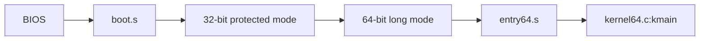
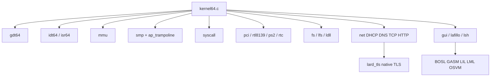
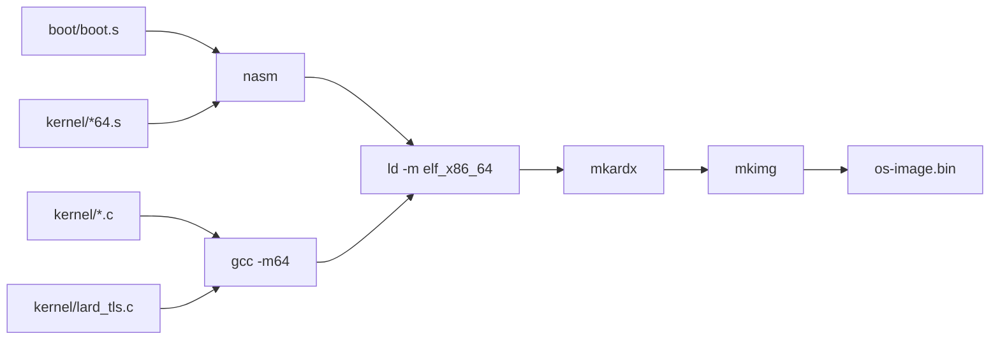
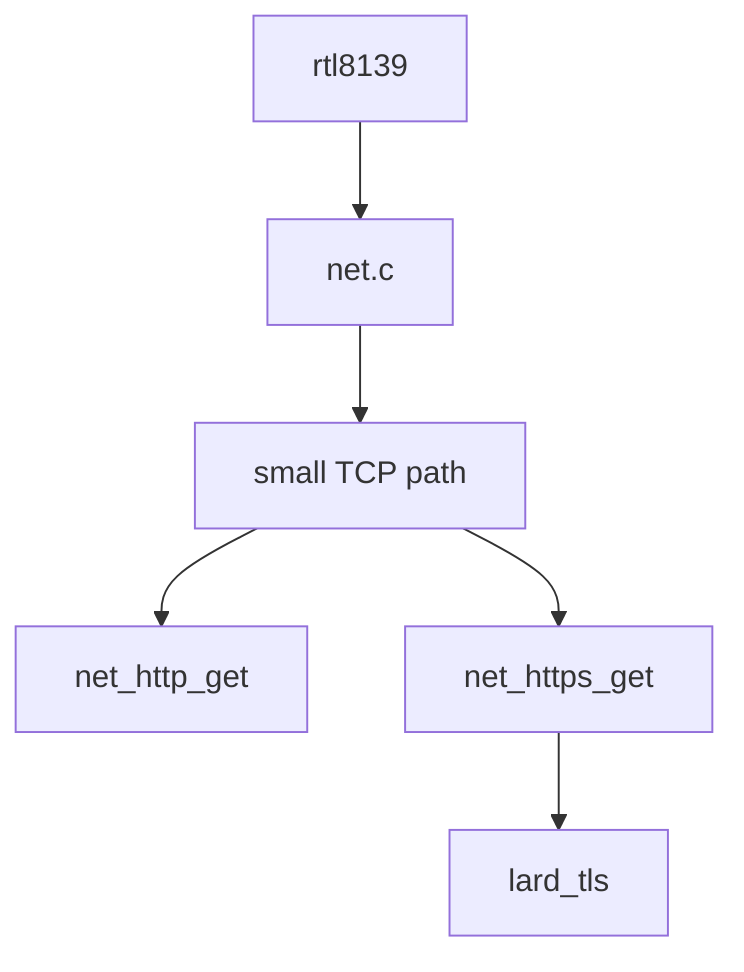

# LardOS Architecture

## Shape

```text
lardos/
|-- os/
|   |-- boot/        BIOS boot sector and long-mode transition
|   |-- kernel/      64-bit kernel C and assembly
|   |-- include/     kernel headers
|   |-- scripts/     host build tools
|   |-- lang/        BOSL, GASM, LIL, LML, examples, libraries
|   |-- tools/       host LIL
|   |-- Makefile
|   |-- deps.mk
|   `-- linker.ld
`-- build/
```

There is no `third_party/` TLS tree. TLS work lives in `kernel/lard_tls.c` and
`include/lard_tls.h`.

## Boot



The boot sector uses the 32-bit phase only as a bridge into long mode. The
kernel payload is built with `-m64`, linked as `elf_x86_64`, and entered through
`entry64.s`.

## Kernel



## Build



## Networking And TLS



The HTTPS path does not call an external TLS library or host HTTPS bridge.
`lard_tls` currently owns the TLS record writer, TLS 1.2 ClientHello, SNI
extension, basic ServerHello parsing, and explicit status reporting for the
remaining crypto work.

## Important Files

| Area | Files |
| --- | --- |
| Boot | `os/boot/boot.s` |
| 64-bit entry | `os/kernel/entry64.s`, `os/kernel/kernel64.c` |
| Descriptor tables | `os/kernel/gdt64.c`, `os/kernel/idt64.c`, `os/kernel/isr64.s` |
| Memory | `os/kernel/mem.c`, `os/kernel/mmu.c` |
| SMP | `os/kernel/smp.c`, `os/kernel/ap_trampoline.s`, `os/kernel/aux_kernel.s` |
| Network | `os/kernel/net.c`, `os/kernel/rtl8139.c` |
| Native TLS | `os/kernel/lard_tls.c`, `os/include/lard_tls.h` |
| GUI and shell | `os/kernel/gui.c`, `os/kernel/lsh.c`, `os/kernel/lafillo.c` |
