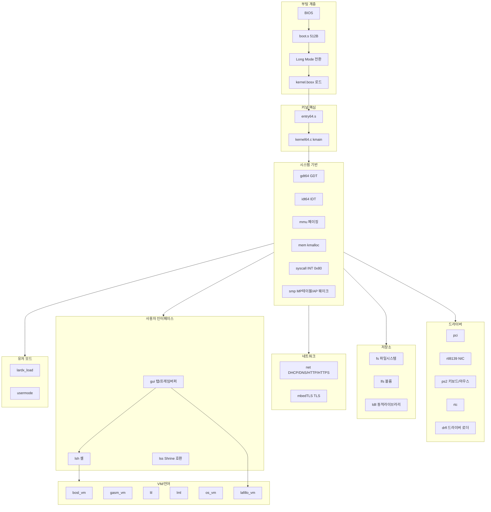
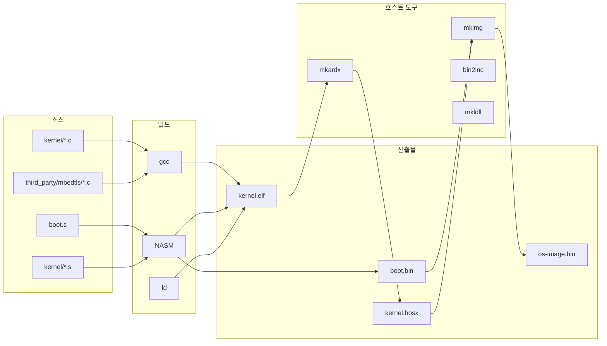
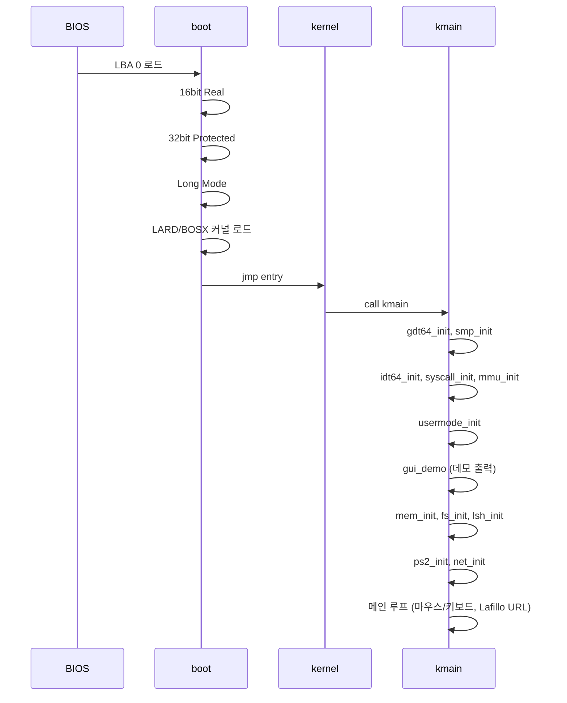
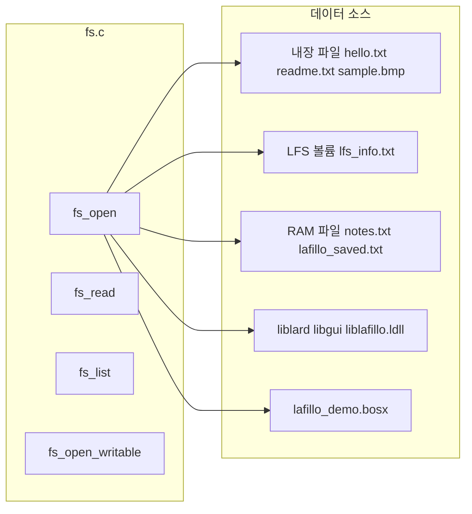
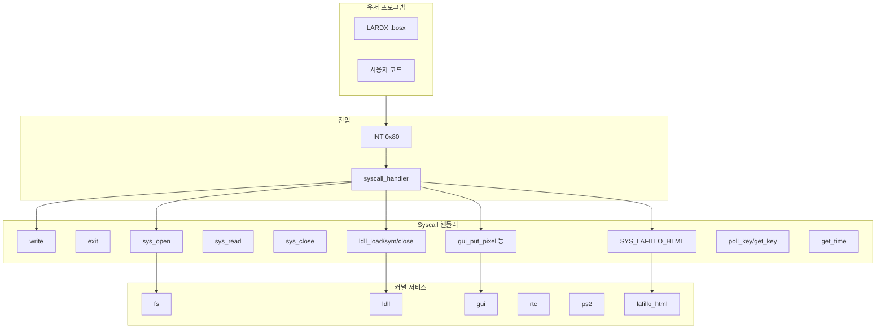
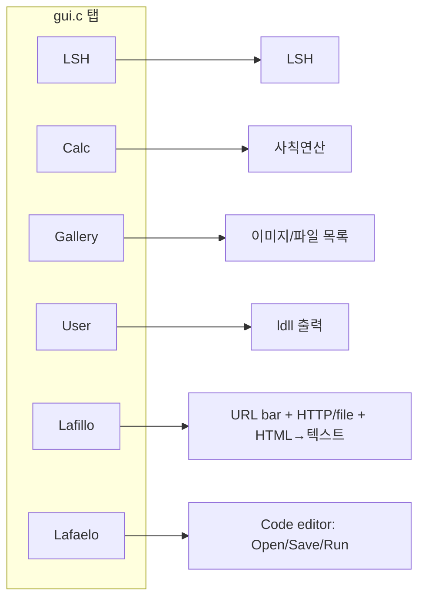
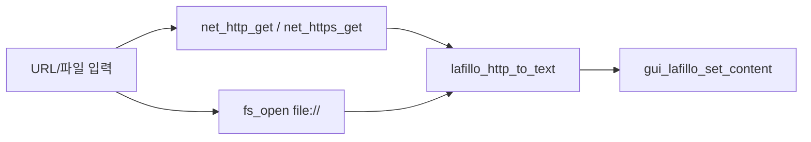
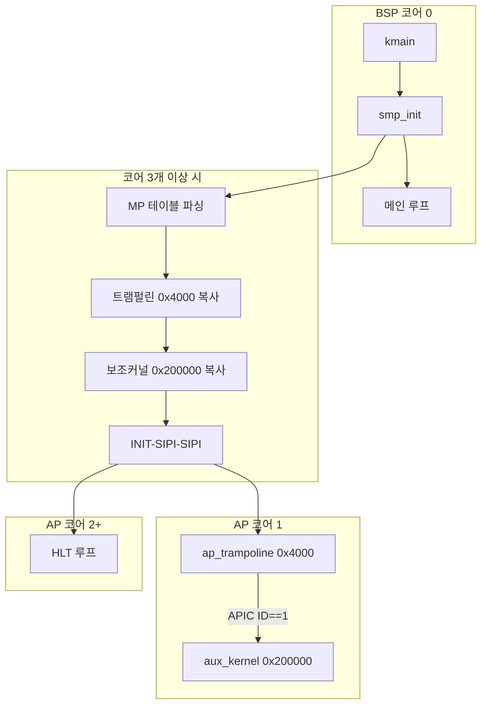
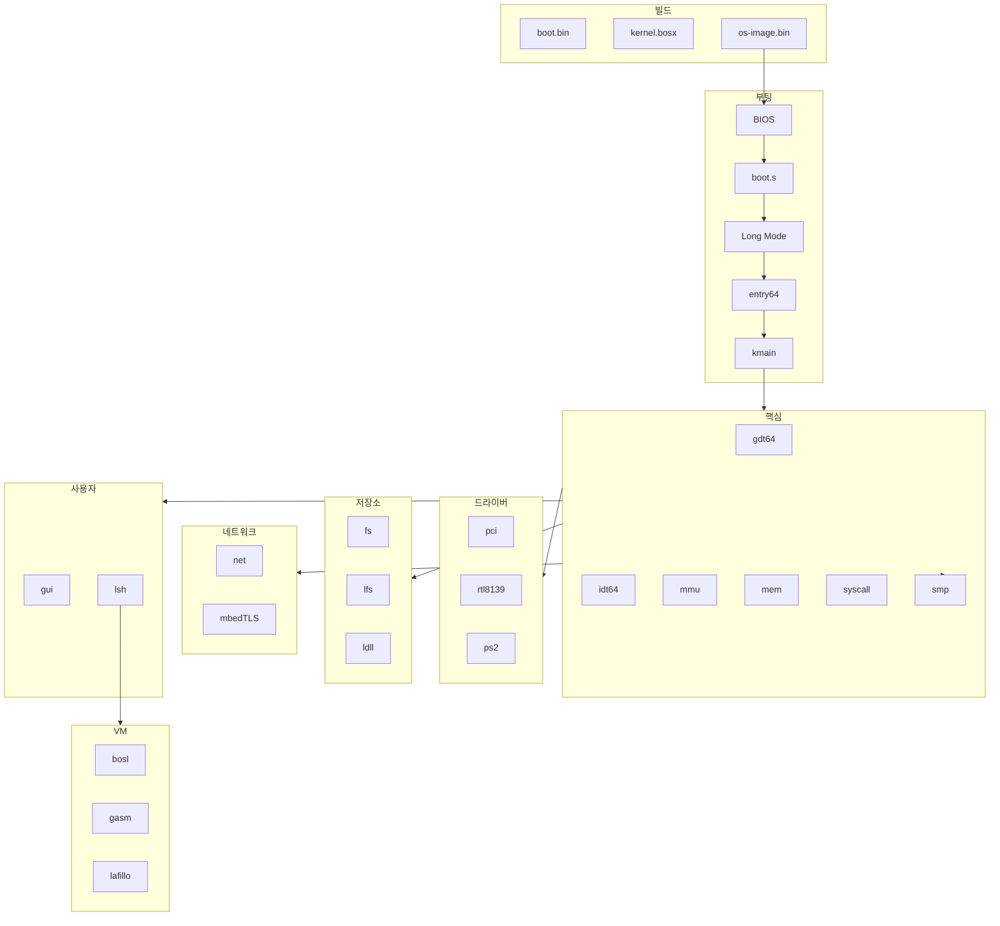

# LardOS 운영체제 전체 구조도

## 0. 디렉터리/파일 구조

```
lardos/
├── os/
│   ├── boot/              boot.s (512B BIOS 부트섹터)
│   ├── kernel/            커널 C/ASM (~60개)
│   ├── include/           공용 헤더
│   ├── scripts/           mkardx, mkimg, mkldll, mklfs, bin2inc 등 호스트 도구
│   ├── lang/              bosla, seed, examples, lib/*.boslib
│   ├── tools/             lil (호스트 LIL)
│   ├── third_party/       mbedtls (TLS), bearhttps (미사용)
│   ├── Makefile           deps.mk, linker.ld
│   └── ARCHITECTURE.md    README.md
└── build/
```

---

## 1. 계층별 구조 개요



---

## 1.5. 빌드 파이프라인



---

## 2. 부팅 → 커널 초기화 흐름



---

## 3. 파일시스템 구조



---

## 4. Syscall, 샌드박스 및 유저 모드

- **샌드박스**: `sandbox` 입력 시 `run` 실행 시 제한된 syscall만 허용 (파일/LDLL/네트워크/GUI 쓰기/키 입력 차단). `exitsandbox`로 해제.



---

## 5. VM/언어 레이어 상세

| VM       | 바이트코드   | 용도             | LSH 명령 | 주요 opcode                       |
| -------- | ----------- | ---------------- | ------- | --------------------------------- |
| BOSL     | BOSL        | 범용 스크립트, MMIO | `bosl`  | pushi/add/print/call/ret/peek/poke |
| GASM     | 9B/insn     | accumulator, OOP | (인라인) | load/add/print/new/invoke         |
| LIL      | S-expression| REPL, 수식       | (호스트) | (+ 1 2), (print x)                |
| LML      | 마크업       | 설정/UI          | (커널)  | config.lml                        |
| OS VM    | OVM         | 운영체제용 단순   | `osvm`  | push/add/sub/mul/div/print/halt   |
| Lafillo VM | DVM         | HTML→텍스트      | `lafvm`   | push/lafillo/print/halt             |
| LARSH    | 텍스트+LMD   | 에니메이션/UI/간단프로그램 | `larsh` | obj/key/rect/circle/text/line/lmd |

---

## 6. GUI 탭 구조



---

## 7. 주요 파일 경로 요약

| 영역       | 경로 |
| ---------- | --- |
| 부팅       | `os/boot/boot.s` |
| 커널 진입  | `os/kernel/entry64.s`, `os/kernel/kernel64.c` |
| 메모리     | `os/kernel/mem.c`, `os/kernel/mmu.c` |
| SMP        | `os/kernel/smp.c`, `os/include/smp.h`, `os/kernel/ap_trampoline.s`, `os/kernel/aux_kernel.s` |
| 파일시스템 | `os/kernel/fs.c`, `os/kernel/lfs.c` |
| 네트워크   | `os/kernel/net.c`, `os/kernel/rtl8139.c` |
| Syscall    | `os/kernel/syscall.c`, `os/include/syscall.h` |
| 유저 실행체| `os/kernel/lardx_load.c`, `os/kernel/ldll.c` |
| GUI        | `os/kernel/gui.c` |
| 셸         | `os/kernel/lsh.c` |
| Lafillo    | `os/kernel/lafillo.c`, `os/include/lafillo.h` |
| VM들       | `os/kernel/bosl_vm.c`, `os/kernel/os_vm.c`, `os/kernel/lafillo_vm.c`, `os/kernel/larsh.c` |
| 스크립트/빌드 | `os/scripts/mkardx.c`, `os/scripts/mkldll.c`, `os/scripts/mklfs.c` |

---

## 8. 데이터 흐름 (Lafillo 예시)



---

## 8.5. SMP/멀티코어 구조

코어가 3개 이상일 때 코어 1에서 보조 모놀리식 커널(aux)을 구동.



---

## 9. 통합 전체 구조도


