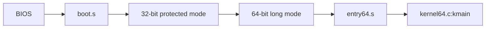
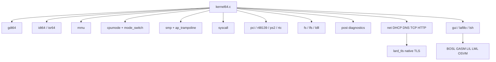
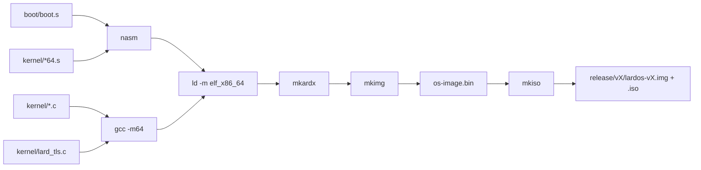
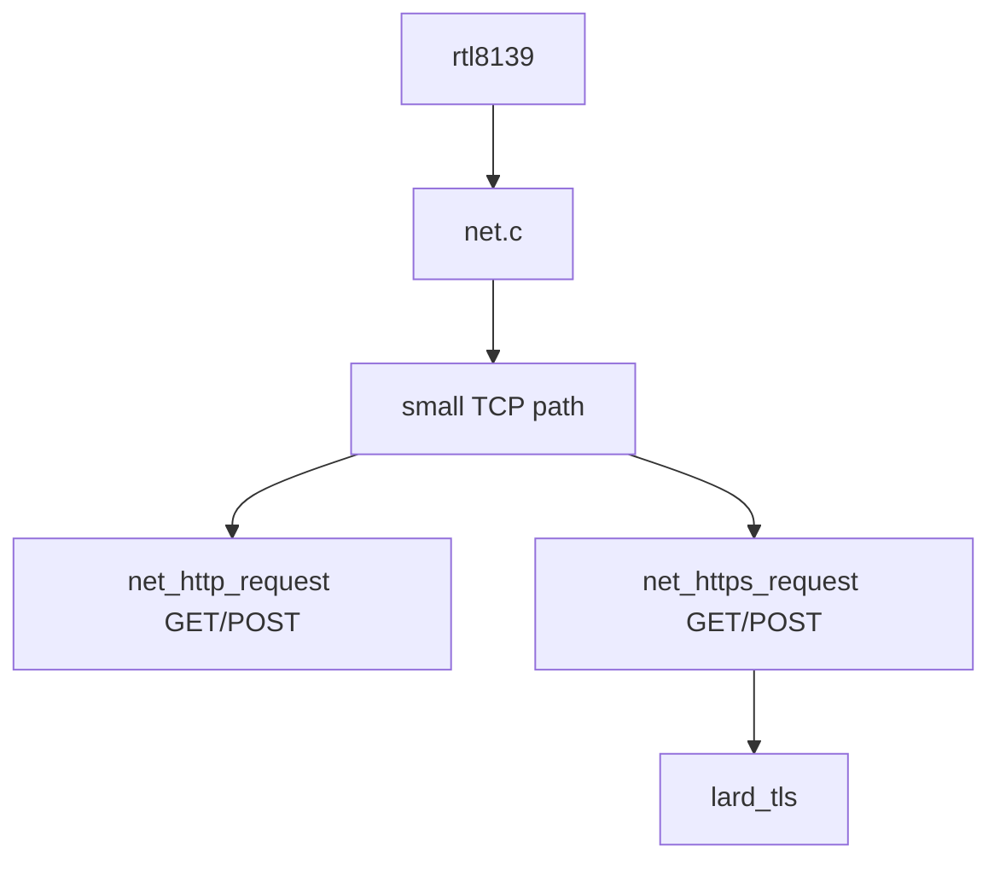

# LardOS Architecture

## Shape

```text
lardos/
|-- os/
|   |-- boot/        BIOS boot sector and long-mode transition
|   |-- kernel/      64-bit kernel C and assembly
|   |-- include/     kernel headers
|   |-- scripts/     host build tools
|   |-- lang/        BOSL, GASM, LIL, LML, examples, libraries
|   |-- tools/       host LIL
|   |-- Makefile
|   |-- deps.mk
|   `-- linker.ld
`-- build/
```

There is no `third_party/` TLS tree. TLS work lives in `kernel/lard_tls.c` and
`include/lard_tls.h`.

## Boot



The boot sector uses the 32-bit phase only as a bridge into long mode. The
kernel payload is built with `-m64`, linked as `elf_x86_64`, and entered through
`entry64.s`.

At runtime the kernel also owns a controlled CPU mode bridge. `cpumode.c` copies
a low-memory trampoline to `0x6000`, and `mode_switch.s` can briefly walk from
64-bit long mode through a 32-bit protected-mode selector into real mode, then
restore paging, EFER, CR3, and the 64-bit code segment before returning to C.
The bridge is explicit: use `mode probe`, the boot-time `M` option, or POST.

## Kernel



## Build



## Networking And TLS



The HTTPS path does not call an external TLS library or host HTTPS bridge.
`lard_tls` owns the TLS 1.2 handshake and record layer for a constrained native
client profile: SNI ClientHello, ServerHello parsing, DER leaf certificate
chain parsing, RSA public-key extraction, SAN/CN and RTC validity checks,
SHA-1/SHA-256/SHA-384 RSA certificate-signature validation, native RSA
trust-anchor matching, RSA ClientKeyExchange, SHA-256 transcript/PRF key
schedule, Finished verification, and AES-128-CBC plus HMAC encrypted
application records.

The implemented cipher suites are `TLS_RSA_WITH_AES_128_CBC_SHA` and
`TLS_RSA_WITH_AES_128_CBC_SHA256`. This is real encrypted HTTPS traffic for
servers that still allow RSA key exchange. It deliberately reports
unsupported-cipher for ECDHE-only sites. Trust anchors live in
`kernel/lard_tls_roots.inc` as subject DER plus RSA public-key parameters
generated from Windows Root stores; the verifier walks the presented chain and
requires the final signature to validate against that native table.

HTTP request construction is shared by HTTP and HTTPS. `net_http_request` and
`net_https_request` support GET and POST, while `net_http_get` and
`net_https_get` remain wrappers for older callers. POST sends
`Content-Length` and `application/x-www-form-urlencoded`; redirects preserve
POST only for 307/308.

## Important Files

| Area | Files |
| --- | --- |
| Boot | `os/boot/boot.s` |
| 64-bit entry | `os/kernel/entry64.s`, `os/kernel/kernel64.c` |
| Descriptor tables | `os/kernel/gdt64.c`, `os/kernel/idt64.c`, `os/kernel/isr64.s` |
| CPU mode bridge | `os/kernel/cpumode.c`, `os/kernel/mode_switch.s`, `os/include/cpumode.h` |
| Memory | `os/kernel/mem.c`, `os/kernel/mmu.c` |
| SMP | `os/kernel/smp.c`, `os/kernel/ap_trampoline.s`, `os/kernel/aux_kernel.s` |
| Power-On Self-Test | `os/kernel/post.c`, `os/include/post.h` |
| Network | `os/kernel/net.c`, `os/kernel/rtl8139.c` |
| Native TLS | `os/kernel/lard_tls.c`, `os/include/lard_tls.h` |
| GUI and shell | `os/kernel/gui.c`, `os/kernel/lsh.c`, `os/kernel/lafillo.c` |

## Built-In User Tools

`kernel/fs.c` embeds `lardos.lars` as a local control-room document for the Doc
tab and `lardd_guide.lardd` as the native document-format guide. LardOS uses
`LARS` instead of HTML for local structured pages and `LARDD` instead of
Markdown for project documents. `kernel/lard_doc.c` renders both formats with a
small freestanding C parser.

`post.c` owns the shared Power-On Self-Test engine. `kernel64.c` exposes it as a
boot-time `P` option, while `M` runs the focused CPU Mode Bridge Test. LSH
exposes the same checks through `post` and `selftest`. POST covers CPU mode, the
real/long bridge, heap allocation, native FS files, LARS/LARDD rendering, LAR
archives, DRFL descriptors, expected PCI devices, GUI
framebuffer/layout state, LPST metadata, LVCS hashing, containers, and LIL
feature forms.

`LSH` provides command discovery (`help`), a system control map (`control`), a
system snapshot (`status`), predicted safe command execution (`magic command`),
CPU mode bridge inspection (`mode`), POST reruns (`post`, `selftest`), native document rendering (`lars`, `lardd`,
`doc`), native LIL script execution (`lil file`), writable RAM file editing
(`write`, `append`, `copy`), LPST persistence
(`sync`/`fssave`), LVCS, Lard containers, the language/runtime launchers, and
SUM-only raw machine controls (`peek`, `poke`, `asm_`).

`magic` is deliberately a prefix command rather than a global autocorrect mode.
It uses a small edit-distance predictor over known built-ins and runs the
predicted safe command directly. Raw ring-0 controls such as `sum`, `peek`,
`poke`, and `asm_` must still be typed explicitly.

LIL is available in both the kernel and the host toolchain. Its control forms
include assertions, `when`/`unless`, `repeat` with the `it` index, stepped
`for` loops, and integer helpers such as `clamp`, `between`, `within`, `pow`,
`gcd`, and `lcm`.

Release suffix policy is deliberately small and visible: `a` is official, `b`
is beta/experimental, and `p` is hotpatch.

Feature work is released as it lands. A feature release updates the kernel
version, records the change in `os/RELEASES.lardd`, embeds the matching
`releases.lardd` file so the `release` command shows the same history inside
LardOS, and produces versioned boot media with `make release`.

Release artifacts are generated without external ISO tooling. `scripts/mkimg.c`
builds the raw BIOS image, and `scripts/mkiso.c` wraps that image in a minimal
bootable El Torito ISO for `release/<version>/lardos-<version>.iso`.
